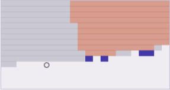

# Notizen

Aufbau, Konventionen und Fallstricke der vier Blätter. Das kurze Vorwort steht im
[README](README.md).

Gemeinsame Handschrift: dieselben CSS-Token, dieselbe Anordnung aus Platte und
Reglerleiste, dieselbe Zwei-Stift-Palette. Jedes Blatt hat einen Knopf, der die
Simulation synchron vorspult — praktisch beim Benutzen und notwendig zum Testen, weil
`requestAnimationFrame` in kopflosen Browsern auf etwa ein Bild pro Sekunde gedrosselt
wird.

---

## Blatt 01 — Kollaps

### Sockel-Konvention (Kachelmodell)

Jede Kachel hat vier Kantensockel `[N, E, S, W]`. Jede Kante wird **im Uhrzeigersinn**
gelesen (N: W→E, E: N→S, S: E→W, W: S→N). Zwei Kacheln passen aneinander, wenn

```
a.sockets[dir] === reverse(b.sockets[gegenrichtung])
```

Dadurch funktionieren auch asymmetrische Kanten (`"lw"` gegen `"wl"` beim Küstensatz)
ohne Sonderfälle. Rotationen entstehen durch Rechtsverschiebung des Sockel-Arrays plus
`ctx.rotate` — beides bleibt automatisch konsistent.

### Overlapping-Modell

Statt handgeschnitzter Sockel: alle N×N-Ausschnitte des 16×16-Bitmaps (umlaufend
gelesen) werden gezählt, die Häufigkeit wird zum Gewicht. Zwei Muster dürfen im Versatz
`(dx,dy)` nebeneinander stehen, wenn sie sich im gemeinsamen Bereich decken. Beide
Modelle kompilieren auf dieselbe Struktur herunter:

```
M.n        Anzahl Optionen
M.weights  Gewicht je Option
M.prop[d]  Bitset der in Richtung d erlaubten Optionen, je Option
```

### Backtracking

Kein Zustands-Schnappschuss (bei hunderten Mustern zu teuer), sondern ein **Trail**:
jede gestrichene Option wird als `zelle * n + option` protokolliert, jede Entscheidung
setzt eine Marke. Rücksprung = bis zur Marke zurücknehmen, die damals gewählte Option
verbieten, Nachbarzweig propagieren. Der Speicher wächst höchstens auf
`zellen × optionen`.

Sicherheitsventil: nach `BACK_LIMIT` erfolglosen Beobachtungen in Folge wird der Zweig
aufgegeben und mit `seed + 1` neu gestartet (Zähler „Neustarts").

Messung an Seed 1004, Overlapping-Modell „Stadt", 36×24:

| | mit Rücksprung | ohne (Neustart) |
|---|---|---|
| Sackgassen | 8 | 8 |
| Neustarts | 0 | 8 |
| Dauer | 20 ms | 131 ms |
| End-Seed | 1004 | 1012 |

### Inkrementelle Entropie

`cnt` / `sw` / `swl` (Optionszahl, Σ Gewicht, Σ Gewicht·log Gewicht) werden bei jeder
Streichung mitgeführt und beim Undo zurückgerechnet. Die Entropie aus den Bits neu zu
rechnen kostet `zellen × optionen` pro Beobachtung — das Kachelmodell verkraftet das,
das Overlapping-Modell nicht.

### Fallstricke

- **`a & b` ist in JavaScript signed int32.** Ein Bitset-Wort mit gesetztem Bit 31
  verglich sich nie gleich mit dem unsigned Wert aus dem `Uint32Array`, also galt die
  Zelle als verändert und wurde endlos neu auf den Propagations-Stapel gelegt. Schlägt
  erst ab 32 Optionen zu — alle Kachelsätze (≤ 17) liefen, das Overlapping-Modell hing.
  Heilung: `(before & allow) >>> 0`.
- **Versiegelter Rand.** Hat ein Kachelsatz nur Kacheln mit durchgehend „belegten"
  Sockeln (Truchet-Bögen: alle `1`), können diese nie an eine Leer-Kachel grenzen.
  Zusammen mit `Rand geschlossen` versiegelt der Leer-Ring das Feld und der Solver läuft
  widerspruchsfrei ins Nichts. Abhilfe: eine Abschluss-Kachel (`1,0,0,0`).
- **Periodische Vorlage ⇒ deterministische Ausgabe.** Ein streng periodisches Bitmap
  legt nach genau einer Beobachtung das ganze Feld fest. Korrekt, aber es zeigt nichts —
  die Beispiele werden deshalb aus einem festen Seed gewachsen, nicht aus einer Formel.
- **Reines Rauschen ist die falsche Vorlage.** 250 Muster bei kaum bindenden Regeln:
  zehn Sekunden pro Lauf. Strukturiert-aber-unregelmäßig ist der brauchbare Bereich.
- **`ctx.arc` Richtung.** Von `-π/2` nach `-π` läuft Canvas ohne `anticlockwise=true`
  den langen Weg — 270° statt 90°.

---

## Blatt 02 — Interferenz

Die diskrete Wellengleichung auf 240 × 160 Zellen, gezeichnet als Höhenlinien über
Marching Squares statt als Farbfläche. Vier Ebenen je Vorzeichen, blau nach oben, rot
nach unten.

- **Harte Quelle spiegelt.** Eine per Zuweisung gesetzte Quellzelle reflektiert alles,
  was zurückläuft; Quelle und Wand bilden einen Resonator und die Amplitude wächst
  unbegrenzt. Additiv einspeisen (`u += s`), dann pendelt sich das Feld ein — gemessen
  bei 0,616 über 2400 Schritte.
- **Konturebenen relativ, nicht absolut.** Feste Schwellen sättigen, sobald die
  Amplitude wandert. Die Ebenen sind Bruchteile eines langsam abklingenden Spitzenwerts.
- Ränder schlucken über eine quadratische Dämpfungszone, damit nichts zurückreflektiert.
- Kosten: 2,5 ms pro Bild für zwei Zeitschritte plus acht Konturebenen.

---

## Blatt 03 — Spur

Physarum auf der GPU: Agentenzustand und Spurfeld als Gleitkomma-Texturen, Ablage über
additives Blending, Diffusion und Verdunstung als eigener Durchgang.

- **Belichtung ist kein freier Parameter.** Die Gleichgewichtsdichte ist ungefähr
  `Ablage × Agenten-pro-Pixel ÷ Verdunstung`. Passt sie nicht zum Wertebereich der
  Darstellung, sättigt alles, es gibt keinen Gradienten mehr zum Riechen und die Agenten
  bleiben auf ihrer Startfigur kleben. Die Ablage wird deshalb auf die Agentendichte
  normiert, damit die Kopfzahl die Struktur ändert und nicht die Helligkeit.
- **Weich sättigen, nicht kappen.** Agenten häufen sich auf den Adern, die lokale Dichte
  liegt weit über dem Mittel. `1 − exp(−dichte)` statt linear, sonst ist jede Ader ein
  flacher Klecks.
- **Radieren braucht eine positive Fragmentfarbe.** `blendFunc(ZERO, ONE_MINUS_SRC_COLOR)`
  mit negativer Quellfarbe ergibt `1 + falloff` und verstärkt, statt zu löschen.
- Die charakteristische Netzweite hängt an Fühlerabstand und Tempo, nicht an der
  Agentenzahl.

---

## Blatt 04 — Zoo

Lenia: Zustand `A ∈ [0,1]`, Nachbarschaft ein Ringkern mit Radius R, Wachstum
`G(u) = 2·exp(−(u−μ)²/2σ²) − 1`, Fortschreibung `A += dt·G(K∗A)`. Der Kern liegt als
Kennlinie in 64 Stützstellen im Shader; die Normierung wird auf der CPU über exakt
dieselben diskreten Stützstellen summiert, damit ein konstantes Feld `u = A` ergibt.

**Das eigentliche Gerät ist nicht der Simulator, sondern die Kartierung.** Zufälliges
Ziehen von (μ, σ) trifft fast nie etwas Tragfähiges. Erst eine grobe Karte über den
Regelraum zeigt, wo das Band verläuft; der Suchlauf zieht dann daraus.



Waagrecht μ, senkrecht σ/μ. Unten alles erloschen (Wachstumsfenster zu eng), oben rechts
überlaufen, dazwischen ein dünner Grat — rund 1 % der Fläche.

### Fallstricke

- **Ringzahl ist die Länge des β-Vektors, keine Konstante.** Mit fest drei Ringen belegt
  β=[1,0,0] nur das innere Drittel von R — der Kern reicht dann über wenige Pixel statt
  über R, und das Ergebnis ist Rauschen auf Pixelebene statt Struktur.
- **`seed * 1103515245` überschreitet 2⁵³.** Der klassische LCG ist in JavaScript nicht
  exakt darstellbar, die Folge entartet. `Math.imul` oder mulberry32 verwenden.
- **Der Torus braucht Kreisstatistik.** Schwerpunkt und Ausdehnung in geraden
  Koordinaten sind auf einem umlaufenden Feld falsch: ein Klumpen auf der Naht mittelt
  sich in die Feldmitte und liest sich als „über alles verteilt" — es fliegen also genau
  die wandernden Strukturen raus, die man sucht.
- **Karte und Suchlauf müssen denselben Test fahren.** Verschiedene Feldgröße, Radius,
  Saatradius oder Prüflänge, und eine als tragfähig markierte Zelle ist es beim Ziehen
  nicht mehr. Jede Abweichung frisst die Trefferquote.
- **Ein kleines periodisches Prüffeld kann Begrenztheit nicht messen.** Expansion läuft
  in sich selbst zurück und sättigt; eine wachsende Kolonie sieht dann aus wie eine
  stehende Kreatur. Erst mit ~16 Kernradien Platz bekommt das Kriterium Zähne.

### Ergebnisse

Blind gezogen: 0 Treffer von 48. Aus der Karte gezogen: 9 bis 14 von 48.

Was der Zufallswurf findet, sind Kolonien, die langsam weiterwachsen — und wie viele es
sind, hängt vor allem an der Prüflänge:

| Prüflänge | Karte | Suchlauf |
|---|---|---|
| 120 Schritte | 67 Felder tragfähig | 33 von 48 behalten |
| 240 Schritte | 3 Felder | 2 von 48 |

### Bergsteigen

Der Grat ist schmal, aber zusammenhängend: man kann ihn nicht treffen, aber
entlanglaufen. Dafür muss die Bewertung eine Zahl sein statt ja/nein — `scoreOf`
bestraft vor allem wachsende Ausdehnung, mild auch Massendrift und Größe, und belohnt
Wanderung. Jede Stufe verwackelt μ, σ und die Ringgewichte, behält das beste Kind nur
bei echter Verbesserung und verkleinert sonst die Schrittweite.

Ein Lauf, Start bei μ=0.370 / σ=0.059:

| | Start | nach 10 Stufen |
|---|---|---|
| Güte | −5.80 (erloschen) | 1.004 |
| Wachstum der Ausdehnung | — | ×1.002 |
| μ / σ | 0.370 / 0.059 | 0.425 / 0.077 |

Gegenprobe im großen Feld (768×512, also 128 Kernradien Platz), 1600 Schritte:

| | Zufallsfund | Erklettert |
|---|---|---|
| Masse | 6.870 → 66.372 (×9,7) | 8.904 → 9.537 (+7 %, am Ende fallend) |
| Ausdehnung | 0,080 → 0,253 (×3,2) | 0,085 → 0,089 (flach) |

**Der Kletterer findet also, was die Zufallssuche strukturell nicht finden kann.**

### Was offen bleibt

- Die Güte **sättigt bei 1.0**, sobald alle Strafterme null sind. Danach zieht nur noch
  der Wanderbonus, und der greift selten — der Kletterer bleibt stehen, obwohl es
  kompaktere Formen geben dürfte. Eine Güte ohne Deckel wäre besser.
- Zwei feste Saaten je Bewertung halten den Vergleich fair, prüfen aber nicht, ob die
  Form gegen andere Anfangsbedingungen robust ist.
- Echte Lenia-Solitonen wie Orbium brauchen eine passende Startfigur. Der Kletterer
  kommt von einer Zufallssaat und findet daher eher kompakte Klumpen als elegante
  Gleiter — begrenzt ja, schön nicht unbedingt.
