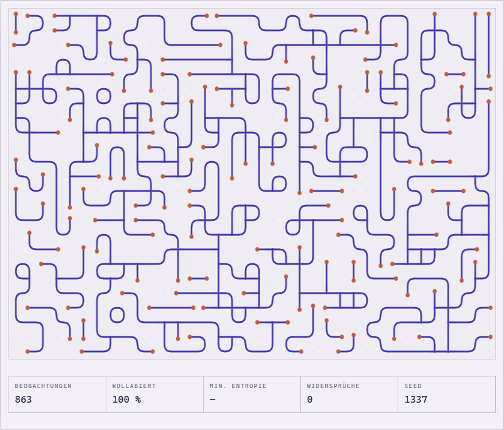
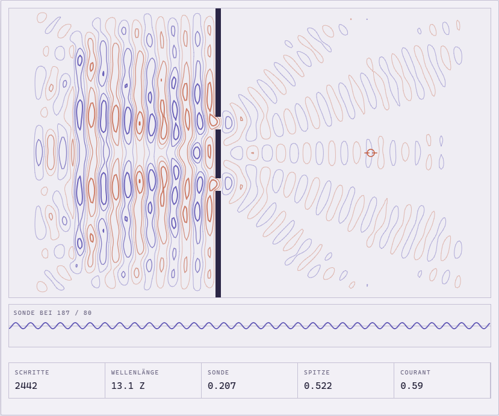
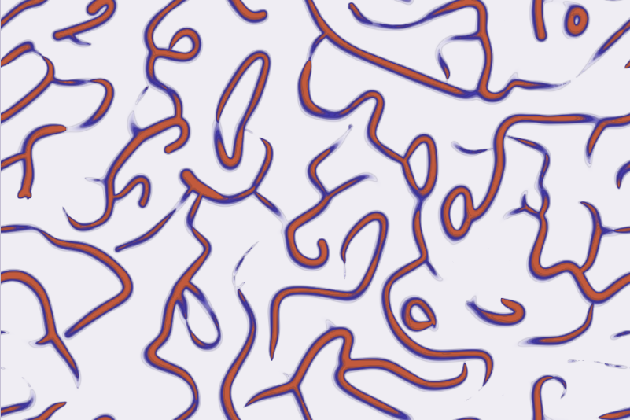
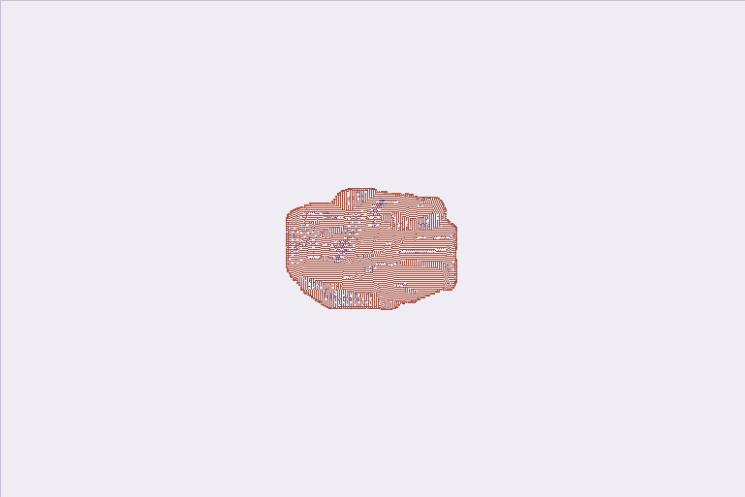
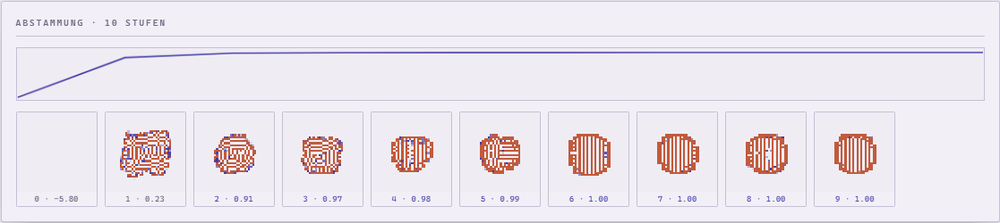

# Plotterblätter

Vier interaktive Blätter über Struktur, die aus lokalen Regeln fällt. Je eine
self-contained HTML-Datei: kein Build, kein Paketmanager, keine externe Zeile Code.

### → [Zur Übersicht](https://ssims437.github.io/plotterblaetter/)

| Blatt | Öffnen | Quelle | Worum es geht |
|---|---|---|---|
| **01 — Kollaps** | [▶](https://ssims437.github.io/plotterblaetter/kollaps.html) | [`kollaps.html`](kollaps.html) | Wave Function Collapse. Kachelsätze und ein aus einem gemalten Bitmap gelerntes Overlapping-Modell, mit chronologischem Backtracking. |
| **02 — Interferenz** | [▶](https://ssims437.github.io/plotterblaetter/interferenz.html) | [`interferenz.html`](interferenz.html) | Die Wellengleichung als Finite-Differenzen-Gitter, gezeichnet als Höhenlinien. Doppelspalt, Gitter, Hohlspiegel; Wände malbar. |
| **03 — Spur** | [▶](https://ssims437.github.io/plotterblaetter/spur.html) | [`spur.html`](spur.html) | Physarum: bis zu einer Million Agenten auf der GPU, drei Regeln, daraus Adernetze. |
| **04 — Zoo** | [▶](https://ssims437.github.io/plotterblaetter/zoo.html) | [`zoo.html`](zoo.html) | Lenia, plus ein Gerät, das den Regelraum kartiert und darin nach Strukturen sucht, die zusammenhalten. |

<p align="center">
  
  
  
  
</p>

Alle vier teilen dieselbe Handschrift: dieselben Farbtoken, dieselbe Anordnung aus
Platte und Reglerleiste, dieselben zwei Stifte. Jedes Blatt kann hell und dunkel und
richtet sich nach der Einstellung des Betrachters.

---

## Warum es das gibt

Nicht wegen der Algorithmen — die stehen alle in der Literatur. Interessant ist, was beim
Bauen schiefging und was sich dabei messen ließ. Das steht deshalb hier vollständig drin,
auch dort, wo das Ergebnis unbequem war.

Der ausführliche Teil steht in **[NOTIZEN.md](NOTIZEN.md)**: Aufbau, Konventionen,
Fallstricke, Messwerte.

### Das Stück, auf das es mir ankommt

Blatt 04 sucht in Lenia nach Regelsätzen, unter denen sich Dichte zu etwas
zusammenzieht, das zusammenhält. Drei Anläufe:

**Blind würfeln.** 0 Treffer von 48. Der tragfähige Bereich macht rund 1 % des
Regelraums aus und liegt als dünner Grat direkt auf der Todesgrenze.

**Erst kartieren, dann würfeln.** Eine grobe Karte über μ und σ/μ zeigt, wo der Grat
verläuft; daraus gezogen werden es 9 bis 14 von 48. Die Karte ist der ganze Unterschied.

Aber: was so gefunden wird, sind **Kolonien, die langsam weiterwachsen**, keine
begrenzten Strukturen. Und wie viele es sind, hängt vor allem davon ab, wie lange man
hinsieht — bei Prüflänge 120 behält der Suchlauf 33 von 48, bei Prüflänge 240 nur noch
2 von 48. Das ist keine Eigenschaft der Regeln, sondern des Messens.

**Bergsteigen.** Der Grat ist schmal, aber zusammenhängend: man kann ihn nicht treffen,
aber entlanglaufen. Aus der Ja/Nein-Prüfung wird eine Güte, dann verwackelt jede Stufe
μ, σ und die Ringgewichte und behält das bessere Kind.

| Start μ 0.370 / σ 0.059 | | nach 10 Stufen |
|---|---|---|
| Güte | −5.80 (erloschen) | **1.004** |
| Wachstum der Ausdehnung | — | **×1.002** |
| μ / σ | 0.370 / 0.059 | 0.425 / 0.077 |

Gegenprobe im großen Feld — 128 Kernradien Platz, 1600 Schritte:

| | Zufallsfund | Erklettert |
|---|---|---|
| Masse | 6.870 → 66.372 (**×9,7**) | 8.904 → 9.537 (**+7 %, am Ende fallend**) |
| Ausdehnung | 0,080 → 0,253 (**×3,2**) | 0,085 → 0,089 (**flach**) |

Das Ding hat allen Platz der Welt und nimmt ihn nicht. Der Kletterer findet damit, was
die Zufallssuche strukturell nicht finden kann.

<p align="center">
  
</p>

Die Abstammungsreihe zeigt es besser als die Zahlen: Stufe 0 tot, Stufe 1 ein
chaotisches Labyrinth, und über die Stufen zieht sich die Form zu einer sauber
gestreiften Scheibe zusammen.

### Vier Fehler, die sich zu erzählen lohnen

1. **`a & b` ist in JavaScript ein *signed* int32.** In einem Mehrwort-Bitset verglich
   sich ein Wort mit gesetztem Bit 31 nie gleich mit dem unsigned Wert aus dem
   `Uint32Array` — die Zelle galt dauerhaft als verändert und wurde endlos neu auf den
   Propagationsstapel gelegt. Schlägt erst ab 32 Optionen zu: alle Kachelsätze liefen,
   das Overlapping-Modell hing. Heilung: `(a & b) >>> 0`.
2. **Ein umlaufendes Feld braucht Kreisstatistik.** Schwerpunkt und Ausdehnung in geraden
   Koordinaten sind auf einem Torus falsch: ein Klumpen auf der Naht mittelt sich in die
   Feldmitte und liest sich als „über alles verteilt". Aussortiert werden damit genau die
   wandernden Strukturen, die man sucht.
3. **Eine hart gesetzte Wellenquelle ist ein Spiegel.** Sie reflektiert alles, was
   zurückläuft; Quelle und Wand bilden einen Resonator, die Amplitude wächst unbegrenzt.
   Additiv einspeisen.
4. **Ein kleines periodisches Prüffeld kann Begrenztheit nicht messen.** Expansion läuft
   in sich selbst zurück und sättigt — eine wachsende Kolonie sieht dann aus wie eine
   stehende Kreatur.

---

## Benutzen

Am einfachsten über die [Live-Fassung](https://ssims437.github.io/plotterblaetter/).
Lokal genügt es, die Datei zu öffnen — über `file://` funktioniert alles; wer lieber
einen Server mag:

```bash
python -m http.server 8000
```

Jedes Blatt hat einen Knopf, der die Simulation synchron vorspult (`Sofort lösen`,
`Einschwingen`, `200 Schritte`). Das ist beim Benutzen praktisch und beim Testen
notwendig, weil kopflose Browser `requestAnimationFrame` auf etwa ein Bild pro Sekunde
drosseln.

**Voraussetzungen:** Blatt 01 und 02 laufen auf Canvas 2D und damit überall. Blatt 03
und 04 rechnen auf der GPU und brauchen WebGL 2 mit `EXT_color_buffer_float`; fehlt das,
sagen sie es statt weiß zu bleiben.

## Aufbau

Jede Datei ist vollständig eigenständig — Stil, Auszeichnung und Code in einem Stück,
keine gemeinsame Bibliothek. Das ist bewusst doppelt: ein Blatt soll einzeln
weitergegeben werden können und dann noch funktionieren. Wer eines ändert, ändert nur
dieses eine.

`index.html` ist die Übersicht und enthält keine Rechnung — die vier Blätter liegen
daneben als `kollaps.html`, `interferenz.html`, `spur.html` und `zoo.html`.

## Lizenz

[MIT](LICENSE) — nimm es, zerleg es, bau was Besseres.
